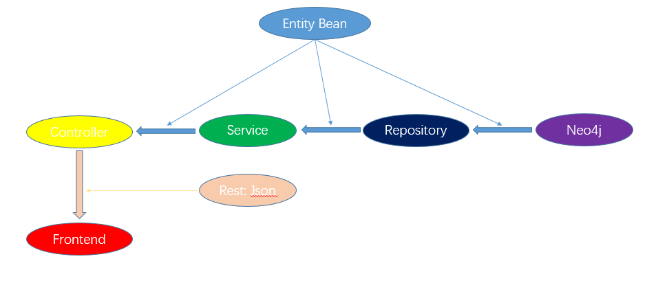
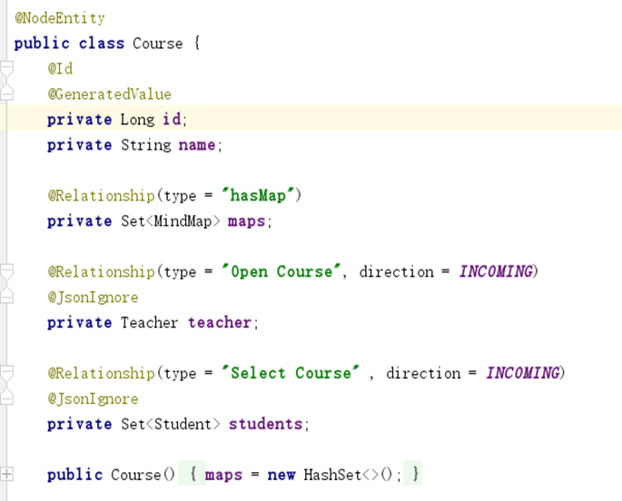
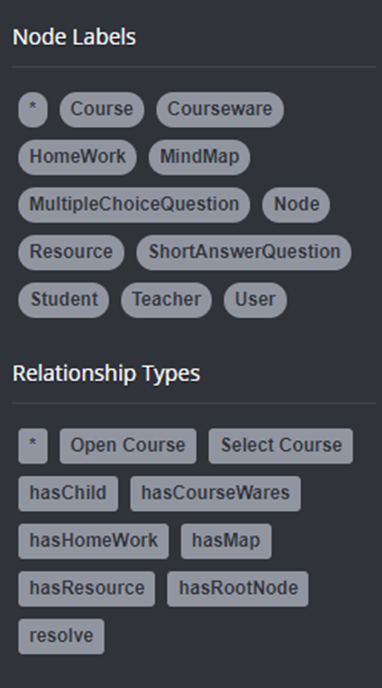
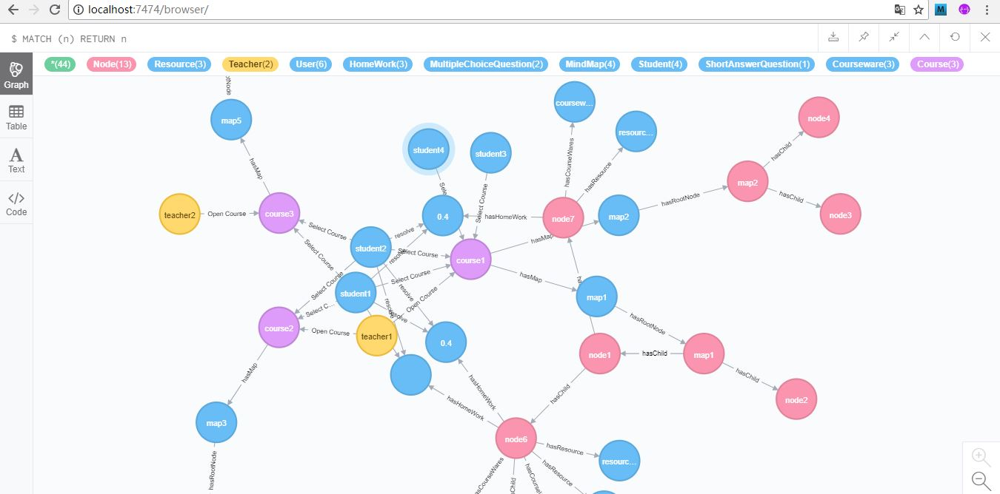
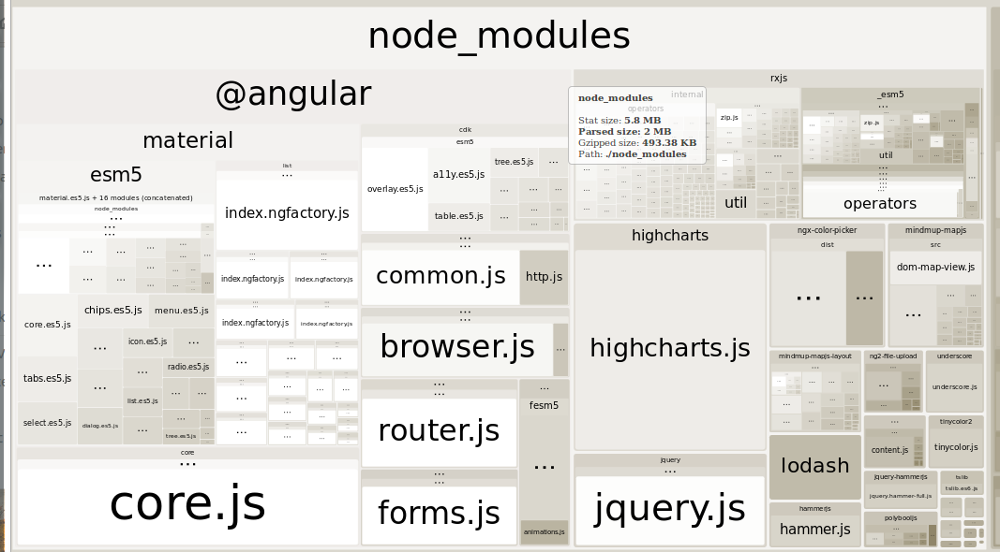
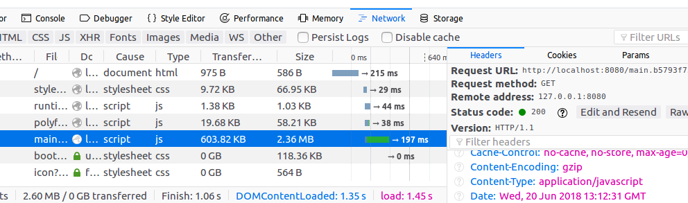

# 高级Web技术PJ文档：思维导图系统

[TOC]

本项目实现的基本功能是一个基于Web的思维导图学习平台。两种用户，教师和学生可以同时使用这个平台。教师可以创建课程，并在课程中创建思维导图、对导图进行编辑；且导图的各个节点均可以关联“作业”、“课件”、“资源”三种附件。学生可以选择课程，查看所选课程中的思维导图，及其中各个节点的附件，且可以回答作业中的问题；教师也能查看每项作业学生的作答情况。

本项目采用前后端分离架构，由后端暴露RESTful API接口供前端调用。所使用的技术栈是：前端采用Angular 6框架，后端采用Spring MVC + Spring Boot框架，以及Neo4j图数据库。最终通过Spring Boot的生成可执行jar包功能，将项目部署在了Google Cloud云平台上。以下介绍各部分的技术实现。

## 前端部分

### 思维导图

对于思维导图的部分，使用了[mindmup-mapjs](https://github.com/mindmup/mapjs)类库。该类库是由[mindmup](https://www.mindmup.com)开发的半开源项目。该类库通过SVG+DOM的形式渲染思维导图，自动封装了诸如节点拖动、改变根节点、自动排版等功能，且在模型中提供了各种操作事件供监听，及操作方法供调用。

美中不足的是，该类库的开源程度不足，文档资源及其缺乏。在GitHub项目页面上提示使用方法请参照[另一个项目](https://github.com/mindmup/mapjs-webpack-example)，对使用方法仅有的说明是关于其所接受的节点树格式。这导致在开发过程中，只能够参照模型的源代码，根据其中各个事件及方法名称猜测其用途。

在项目中的`mindmap-body`组件中，封装了这个类库在项目中所需要用到的一些基本功能，如加入、删除节点及修改颜色等供外部调用的操作；以及用户对图的修改事件等。将其处理为Angular组件的形式，便于外部调用。

### 用户相关功能

与用户相关的功能主要封装在了`login-and-register`模块中，包括各组件和这些组件的路由模块。除了`current-user-service`服务和`auth-guard.ts`中的路由守卫在该模块之外。

####`current-user-service`服务

`current-user-service`服务是一个整个应用中单例的服务。关于用户的功能，发送http请求的部分均封装在了`current-user-service`服务中。此外，该服务还维护一个持续整个生命周期的`Subject`对象。这是为了便于顶部导航栏的`nav`组件进行订阅，以便其随时获知当前用户的变化、显示在导航栏的右上角。

应用中各个组件如有需要当前用户角色的，则调用该服务以便获知。值得注意的是位于`auth-guard.ts`中的`AuthGuard`和`RoleGuard`两处路由守卫：两者分别控制路由限制已登录/未登录用户访问；以及限制某一特定角色访问。例如，在路由守卫中，限制某些路由由教师角色访问，则使用：

```typescript
{
  path: '...', component: ...,
  canActivateChild: [RoleGuard],
  data: { role: 'TEACHER' },
},
```

路由守卫`RoleGuard`会调用`current-user-service`服务查询当前用户角色，并根据路由的`data`字段判断是否允许访问。

#### 表单

与用户相关的表单包括登录、注册和修改密码。其中后两者需要在前端进行表单验证，因而使用了Angular响应式表单。登录界面较为简单，因而使用模板驱动表单。

在两处使用响应式表单的页面中，使用了[Angular Material](https://material.angular.io)库中的`mat-input`支持，当`FormControl`的验证器有错误时，以Material UI的样式实时显示。如：

```html
<mat-error *ngIf="confirmPasswordFormControl.hasError('required')">
  密码不能为空
</mat-error>
```

### 应用主体

应用主体位于`mindmap-holder`模块中。它封装了已登录用户在主页中除导航栏外的显示部分。组件基本包括：显示思维导图的容器`mindmap-holder`，左侧用于显示课程和思维导图列表的`sidenav`，右侧用于显示作业、资源或课件侧边栏的各组件，以及作业中用于显示选项比率的`pie-chart`。除此之外还有两个分别执行课程和图的http逻辑的`course-service`和`node-service`服务，以及一个控制本模块路由的路由模块。

####`mindmap-holder`组件

该组件引用了`mindmap-body`组件，在其基础上增加了操作按钮和作业、资源、课件（以下简称附件）列表，封装了显示附件以及处理用户对图的修改的功能。

操作栏中的“选择颜色”按钮，点击后会弹出颜色选择框，这一功能使用了[ngx-color-picker](https://github.com/zefoy/ngx-color-picker)类库。

附件列表使用了Material UI提供的`mat-chip-list`组件，将每一个附件项目作为一个`chip`显示在一个横栏之中，点击则跳出右侧的侧边栏。

右侧的侧边栏使用了Material UI提供的`mat-drawer`组件，是本组件的路由出口。为了使用`mat-drawer`提供的侧边栏开启/关闭动画，向路由出口的`activate`和`deactivate`事件绑定了开启/关闭`mat-drawer`操作。

该组件的主体部分是利用`mindmap-body`组件所封装的事件和方法。在操作按钮栏中的“增加节点”、“删除节点”等按钮，通过`mindmap-body`组件的方法调用，反馈至思维导图中。而思维导图的一系列操作事件，则由`mindmap-body`所提供的`manipulation`事件绑定进行处理。这些操作事件，包括节点选择的更改，用户直接在导图内触发的事件（如双击改名）以及由外部按钮触发的事件（如添加节点）。

在这里，添加节点等事件是由`mindmap-holder`本身触发的，但仍然通过监听事件的方式进行处理（而非每当触发时同时处理），这是为了遵循Single Source of Truth原则：图中的一切变化以其被触发的事件为准。这一模式最大的好处是简化了撤销与重做功能的处理：当用户点击“撤销”时，`mindmap-body`也会触发相应的操作事件，而非“撤销”事件，从而这些事件可以像普通的操作事件一样进行处理。

当节点选择被更改时，下方的附件列表会进行重新加载。

其余的所有事件都涉及到对图的修改。本应用为了节省频繁的网络传输工作，本应用选择了维护一个修改操作的队列，直到用户点击保存按钮后再进行提交。该队列为`mindmap-holder`组件中的`manipulations`数组。

当图中的修改发生时，程序并非简单地将新的修改操作添加至队列。对于一些幂等性的操作（例如对一个节点多次修改其名称或颜色），程序记录时会将之前的一次修改删除。对于删除新添加节点的操作、撤销删除已有节点的操作等，也不会重复放置“添加节点”和“删除节点”两个记录。

#### `node-service`服务

该服务封装了关于图和节点的操作的http逻辑，包括获取图的节点、修改图、获取节点的附件、增加或修改附件等等。除了普通的封装之外，该服务还对附件中**作业**这一类别进行了更多的处理。

用户可以选择在新添加而尚未保存的节点中添加作业。在`node-service`服务中，维护了一个当前图中所有已保存节点的列表，每当获取图以及更新图时更新该列表。当调用`node-service`服务增加一项作业时，它会检查所添加到的节点是否在列表中。若不在，则暂存在一个cache数组里，在更新图时将添加作业的请求一并发送。

`node-service`服务对这一功能做到了较好的封装性，`mindmap-holder`可以在新添加的节点上同已有节点一样的方式调用添加作业的方法。

但对于**资源**和**课件**这两个类别的附件，`node-service`并没有进行这一处理。因为它们涉及到上传文件的操作，而cache并不适宜暂存一个文件。

#### `sidenav`组件

该组件封装了页面左侧，显示课程与图列表的树形结构的功能。包括树形列表的显示，以及条目（课程或图）的增加与删除。

本组件是`mindmap-holder`模块的路由根组件，子组件是`mindmap-holder`。当用户选择一个导图时，会导航至显示导图的URL，导图将在页面的中间显示出来。

该组件是仿照Material UI中的Tree组件的[一个样例](https://material.angular.io/components/tree/examples)所编写的。基本思想是：建立一个名为`CourseListDatabase`的可注入（`@Injectable`）类，用来维护`mat-tree`中所显示的`FlatNode`的列表。`CourseListDataBase`提供了一系列修改列表的方法，如增加、删除条目等；并提供一个`Subject`对象作为`Observable`，供组件监听列表的变化。

本组件相关的http逻辑均包含在`course-service`中。

#### 回答作业与发布作业

用户点击主页面下方的作业条目时，教师会进入发布作业界面，学生会进入回答作业界面，显示在右侧侧边栏中。两者的相应组件分别是`release-question`和`answer-question`。

回答作业的界面逻辑较为简单：获取数据，显示为表单，并处理提交即可。

在发布作业界面中，发布**选择题**的逻辑较为复杂。由于选择题的总选项数目不固定，因而需要允许用户动态增删选项条目。这里使用了Angular响应式表单的`FormArray`机制：选项列表绑定到`FormArray`上，当用户选择增加或删除选项时，则向`FormArray`中增删元素。这样一来，在包装该`FormArray`的`FormGroup`中所获得的选项数据就成为了长度不固定的数组，可以直接向后端提交。

在发布作业界面中，若教师选择的是新建作业，则只会显示新增作业的表单；而如果选择的是已有作业，则会显示已有作业的内容，当用户点击修改按钮时再出现表单。显示已有内容时，如果是**选择题**，则会显示选项人数分部图。该图表位于`pie-chart`组件中，使用了[Highcharts](https://www.highcharts.com)类库。

#### 上传、下载课件和资源

教师可以添加课件和资源。课件均是文件形式；而资源分为URL类型和文件类型两种。对于课件与文件类型的资源，教师可以通过上传页面上传。

课件和资源的上传组件分别是`upload-course`和`upload-resource`。其中，后者在上传文件类型的资源的位置直接复用了前者。前者使用了[ng2-file-upload](https://github.com/valor-software/ng2-file-upload)类库来处理文件上传，直接使用了其[样例](https://github.com/valor-software/ng2-file-upload/tree/master/demo)中的大部分代码。

学生和教师在主页面下方的课件或资源条目点击，若是文件类型，则会直接显示浏览器下载界面。这里使用了`Blob`机制：在`HttpClient.get`方法中，注明泛型类型为`Blob`，且接收的`responseType`为`'blob' as 'json'`（`as 'json'`是`get`方法的强制要求），即可在用户界面上显示浏览器下载界面。

### 前端部分的其他细节设计

#### `Promise`

Angular中包含许多异步操作，而有时所需要的数据可能还未被初始化。例如在`pie-chart`组件中，需要在获得`qid`（问题id）时就使用HTML元素；但HTML元素的初始化则在`ngAfterViewInit`生命周期中，在获得`qid`时可能未被初始化。这时可以使用`Promise`机制，如在组件的全局设置两个变量：

```typescript
private componentInitResolve: Function;
private componentInitPromise = new Promise(resolve => this.componentInitResolve = resolve);
```

如此，则`componentInitPromise`在某处调用`componentInitResolve`函数时才会被填充。因此，在`ngAfterViewInit`方法中调用`componentInitResolve`；而在设置`qid`时将需要使用HTML元素的部分放置在`componentInitPromise.then`中，即可解决这一异步问题。

#### 观察者模式

在Angular中，需要多处使用`rxjs`库提供的`Observable`，其是对于观察者模式的一种封装。其与`Promise`不同之处在于：`Promise`只有一次被填充；而`Observable`则可以在`complete`之前发生多次变更。对于直至应用生命周期结束前才`complete`的`Observable`，称为**持续性**的`Observable`。

在观察者模式中，被观察对象（`Observable`）持有对观察者的引用。因而，一旦`Observable`释放资源（调用`complete`或其本身被释放），其所注册的观察者也都将一并释放。反之，但凡持续性的`Observable`不释放其资源，其所注册的观察者也将一直存在。而如果观察者在某一时间点不再需要持续性`Observable`数据，就应将其释放；否则将造成内存泄漏。在这一场景下，需要调用`Observable.unsubscribe`方法，取消对`Observable`的订阅。

例如在`sidenav`组件中的如下代码片段：其需要在第一子路由被初始化时获取被选择的图。但是，由于路由的`event`是一个持续性的`Observable`，而这里只需要使用一次，所以当订阅的回调函数被调用时，随即取消对其的订阅：

```typescript
const subscription = this.router.events.subscribe(e => {
  if (e instanceof NavigationEnd && this.router.isActive('/mindmap', false)) {
    console.log(this.route.firstChild);
    this.initMindmapRoute(this.route.firstChild);
    subscription.unsubscribe() // Unsubscribe here
  }
});
```

#### Mock数据

在开发时，为了提高效率，采用了前后端协同开发的方式。而当后端的RESTful接口尚未开发完成前，若需要测试前端功能，则需要Mock接口。

Angular提供了请求拦截器的功能：实现一个`HttpInterceptor`对象，并将其注册到根模块，即可由拦截器拦截任何由`HttpClient`发送的请求。注册到根模块的方式如下：

```typescript
providers: [
  environment.production ? [] : {
    provide: HTTP_INTERCEPTORS,
    useClass: MockProviderService,
    multi: true,
  },
  ...
],
```

在这里自动依据当前是否为production环境判断是否引入该拦截器。

本应用中，使用`mock-provider-service`拦截请求，以Mock数据作为响应返回。Mock数据形式如下：

```typescript

export const mockData = {
  'GET /api/node/attachments/:id': {
    'questions': [...],
    'coursewares': [...],
    'resources': [...],
  },

  'GET /api/mindmaps/list/:courseId': [
    { id: 0, name: '...' },
  ],
  
  ...
}
```

即，将请求的方法+URL格式作为Javascript对象的键，其Mock响应体作为值。在拦截器中，在`mockData`中依次查找与请求相匹配的条目，进行返回。

此外，拦截器还对返回的请求执行了`delay`操作：

```typescript
...
return mockDatum ?
  of(null).pipe(mapTo(new HttpResponse(response)), delay(2000))
  : next.handle(req);
```

如此，所有由Mock返回的响应都会延迟2秒再发送。这一操作可以用于测试请求已发送但未响应时的效果。

#### 分离导入

在前端所使用的Angular Material UI和[lodash](https://lodash.com/)两个类库都支持分离导入，即：只导入所需要用到的部分。由于两者都只提供了一系列相互不依赖的工具，因而只将所需要的部分导入，可以减少Webpack打包得到bundle的大小。以lodash为例：

```typescript
import escapeRegExp = require('lodash/escapeRegExp');
```

这一语句可以只引入lodash的`escapeRegExp`函数。而它的一般用法：

```typescript
import * as _ from 'lodash';
_.escapeRegExp(...)
```

则会导致整个lodash包被引入，导致bundle中出现冗余。

##后端部分

### 整体架构

架构图：



包结构：

```
└── src
    └── frotend
    └── main
        └── java
        	└── application
        		└── config
        		└── controller
        		└── entity
        		└── repository
        		└── service
        		└── validator
        		└── SpringBootWebApplication.java
```

架构介绍：

就像上面的架构图所展示的，后端主要分为四个部分：neo4j（数据库），repository， service 以及controller。在这四个部分中，传递以entity bean为model的数据。其中，repository负责对数据库进行直接操作（增删改查）；service负责将repository整合，从而提供一定的服务；controller则负责根据service能提供的服务，产生一个API URL，为前端提供restful的数据服务。  

#### Neo4j与Entity Bean 

Entity Bean是生成的实体类，也是数据库中的存储单元。要做到这一点，我们需要在生成的实体类加上注解 @NodeEntity，为了标识所有的节点，我给所有的entity bean class都加上了Id属性，并且给它加上注解@Id和@GenrerateValue 。另外，前面对Neo4j的介绍也说了，neo4j数据库里，主要由节点（node）和关系（relationship）组成。这里已经有了node，还差relationship，这就涉及到了另一个注解@Relationship。如下图所示，注解@Relationship表示了该node与其他node的关系，在class中是class的属性。



多个node相互作用就形成了数据库的结构。



与关系型数据库不同的是，关系型数据库相关的应用都是事先将数据库的结构定义好，然后程序对数据的数据进行增删改查操作，并不涉及数据库结构的改变。然而在neo4j数据库中，能够在通过程序中添加一些注解为@NodeEntity的class改变数据库结构。

#### Neo4j -> Repository 

定义好了数据库的数据结构，接下来就该添加代码连接数据库的地方了。创建一个config，用于连接数据库

```
src/main/java/application/config/PersistenceContext.java
```

```java
package application.config;

import org.springframework.context.annotation.Bean;
import org.springframework.context.annotation.ComponentScan;
import org.springframework.context.annotation.Configuration;
import org.springframework.data.neo4j.repository.config.EnableNeo4jRepositories;
import org.springframework.transaction.annotation.EnableTransactionManagement;

@Configuration
@EnableTransactionManagement
@ComponentScan
@EnableNeo4jRepositories
public class PersistenceContext {
    @Bean
    public org.neo4j.ogm.config.Configuration configuration() {
        return new org.neo4j.ogm.config.Configuration.Builder()
                .uri("bolt://localhost")
                .credentials("neo4j", "123456")
                .build();
    }
}

```

完成了对数据库的连接，接下来就要创建Repository 接口来实现对数据库的操作，根据前面创建的Entity，生成对应repository，以Course为例：

```
src/main/java/application/repository/CourseRepository.java
```

```java
package application.repository;

import application.entity.Course;
import org.springframework.data.neo4j.annotation.Query;
import org.springframework.data.repository.CrudRepository;

import java.util.Set;

public interface CourseRepository extends CrudRepository<Course, Long> {
    Course findById(long id);

    Course findByName(String name);

    void deleteById(long id);

    @Query("MATCH (n:Course) WHERE n.name =~ {0} RETURN n")
    Set<Course> findByNameLike(String query);

    @Query("MATCH (a:Course)<-[r:`Select Course`]-(b:Student)-[r1:resolve]->(x:HomeWork)<-					[:hasHomeWork]-(n:Node), " +
            "(a)-[:hasMap]->(m:MindMap)-[:hasRootNode]->(n0:Node)-[:hasChild*]->(n1:Node) " +
            "WHERE id(b)={0} AND id(a)={1} AND n IN [n0, n1] DELETE r, r1")
    void deselectCourse(long studentId, long courseId);
}
```

#### Repository -> Service 

在repository之上，我们需要包装一层service，用来整合完成一个事件时（比如说学生选课事件），所需要的所有repository操作。同样以course为例

```
src/main/java/application/service/CourseService
```

```java
public interface CourseService {
    Course getById(long id);
    Course getByName(String name);
    Set<Course> getByTeacherId(long id);
    Set<Course> getByStudentId(long id);
    Course getByMindMapId(long mindMapId);
    Course addCourse(long teacherId, String courseName);
    Course selectCourse(long studentId, long courseId);
    void deselectCourse(long studentId, long courseId);
    void deleteCourse(long id);
    void deleteAll();
    void updateCourse(Course course);
    Set<Course> queryByName(String name, long studentId);
}
```

```
src/main/java/application/service/impl/CourseServiceImplement
```

```java
@Service
public class CourseServiceImpl implements CourseService {

...
  @Override
    public Course addCourse(long teacherId, String courseName) {
        Teacher teacher = (Teacher) userRepository.findById(teacherId);
        Course course = new Course();
        course.setName(courseName);
        course.setTeacher(teacher);
        return courseRepository.save(course);
    }
...
```

在实现对用service的时候，给对应的ServiceImpl加上注解@Service，这样一来。就能够使得在需要service的地方，只要声明为@Autowired，框架就会帮其自动匹配到它的实现类（ServiceImpl）

#### Service -> Controller 

完成了上述的工作，service已经准备好了前端需要的各种服务，这时候我们需要将前后端连接起来，这时候就需要controller。生成一个Controller类，给它加上注解@Controller；然后通过@RequestMapping注解，给它配上API URL，进行路由控制；最后通过@ResponseBody @RequestBody 两个注解分别是向前端发送数据和从前端获取数据。同样以一个controller为例：

```java
src/main/java/application/controller/CourseController.java
```

```java
import application.controller.result.JsonResult;
import application.controller.util.CurrentUserUtil;
import application.entity.Course;
import application.entity.CurrentUser;
import application.entity.Role;
import application.service.CourseService;
import org.springframework.beans.factory.annotation.Autowired;
import org.springframework.http.ResponseEntity;
import org.springframework.security.access.prepost.PreAuthorize;
import org.springframework.stereotype.Controller;
import org.springframework.web.bind.annotation.*;

import java.security.Principal;
import java.util.Set;

@Controller
public class CourseController {
    private final CourseService courseService;

    @Autowired
    public CourseController(CourseService courseService) {
        this.courseService = courseService;
    }

    @PreAuthorize("hasAnyAuthority('TEACHER')")
    @RequestMapping(value = "/api/course/add", method = RequestMethod.POST)
    public @ResponseBody
    Course addCourse(
            @RequestBody Course course) {
        return courseService.addCourse(CurrentUserUtil.getCurrentUser().getId(),
                course.getName());
    }
    ...
}

```

#### Restful: Json 

根据前文controller的代码，我们可以发现不管是从前端获取数据，还是向前端发送数据，中间传输的数据似乎都是一个java 对象(比如Course course)。但实际上，经过框架的作用，从前端获取的json数据会被解析成java对象，而发送给前端的数据则会被转化成json数据。以course的一个API为例：

```
/api/course/get/:id
```
上面的URL能产生如下的json数据：

```json
[
    {
        "id": 122,
        "name": "apue",
        "maps": [
            {
                "id": 168,
                "name": "map3",
                "rootNode": null
            },
            {
                "id": 169,
                "name": "map2",
                "rootNode": null
            },
            {
                "id": 167,
                "name": "map1",
                "rootNode": null
            }
        ]
    },
    ...
]
```
### 数据库结构介绍

Neo4j数据库作为一个nosql数据库，其主要是由node（节点）和relationship（关系）组成。在project中，数据库的结构是由entity决定的。entity中的nodeEntity对应为数据库的node，nodeEntity中间的关系对应为relationship。具体在本project中设计了哪些node和relationship，将会在下文进行介绍。

####  Node节点

| NodeEntity(java 对象)  | node(数据库 node)      | 继承关系       |
| ---------------------- | ---------------------- | -------------- |
| User                   | User                   |                |
| Teacher                | Teacher                | 继承自User     |
| Student                | Student                | 继承自User     |
| Course                 | Course                 |                |
| MindMap                | MindMap                |                |
| Node                   | Node                   |                |
| HomeWork               | HomeWork               |                |
| MultipleChoiceQuestion | MultipleChoiceQuestion | 继承自HomeWork |
| ShortAnswerQuestion    | ShortAnswerQuestion    | 继承自HomeWork |
| Courseware             | Courseware             |                |
| Resource               | Resource               |                |
| VerificationToken      | VerificationToken      |                |

#### Relationship关系

| Relationship  | 涉及的NodeEntity    | Entity中的属性                                               |
| ------------- | ------------------- | :----------------------------------------------------------- |
| Open Course   | Teacher -> Course   | Teacher: Set<Course> courses                                 |
| Select Course | Student -> Course   | Student: Set<Course> courses                                 |
| hasChild      | Node -> Node        | Node: Set<Node> childNodes                                   |
| hasCourseware | Node -> Courseware  | Node: Set<Courseware> coursewares                            |
| hasHomeWork   | Node -> Homework    | Node:  Set<HomeWork> homeWork                                |
| hasMap        | Course -> MIndMap   | Course: Set<MindMap> maps                                    |
| hasResource   | Node -> Resource    | Node: Set<Resource> resources                                |
| hasRootNode   | MIndMap -> Node     | MindMap:  Node rootNode                                      |
| resolve       | Student -> HomeWork | Student: Set<StudentAnswerForMultipleChoice> studentAnswerForMultipleChoice |
| resolve       | Student -> HomeWork | Student: Set<StudentAnswerForShortAnswer> studentAnswerForShortAnswer |
| VERIFY        | VerificationToken -> User |VerificationToken: User user|

注：为了实现node之间的双向引用，Entity中的属性都是双向的，比如说Open Course这个Relationship，表现在Teacher Entity中是  Set<Course> courses  属性，表现在Course Entity中，就是Teacher teacher属性，这里因为篇幅原因，不再展示。

#### 表现

以上节点和关系表现在数据库中，以如下图谱的方式展现：



### Spring Security的使用

Spring Security是Spring推出的有关访问控制的框架。其封装了许多后端应用访问控制的常用功能。在本应用中，使用到了其用于登录和控制器访问权限的功能。

#### 登录

Spring Security中的Authentication Manager模块封装了验证用户的功能，而它的默认实现则进一步提供了登录功能的简易接口。登录功能的实现包含如下部分：

1. **实现一个`UserDetails`类，用于表示用户信息。**

项目中的`application.entity.CurrentUser`类实现了该接口。实际上，它与数据库实体类`User`在功能上大致相同：包含用户的登录名（本应用中是email）和角色。但两者的区别在于关注点不同：`CurrentUser`代表访问控制所使用的实体；而`User`则是业务逻辑中所使用的实体类。所以两者采用了组合的模式：`CurrentUser`维护一个`User`对象。

`CurrentUser`的构造方法如下：

```java
public class CurrentUser extends org.springframework.security.core.userdetails.User {

    private User user;

    public CurrentUser(User user) {
        super(user.getEmail(), user.getPasswordHash(), AuthorityUtils.createAuthorityList(user.getRole().toString()));
        this.user = user;
    }
}
```

通过`super`调用，这里明确了Spring Security所需的用户密码以及角色的来源分别是`User.getPasswordHash`和`User.getRole`。

2. **实现一个`UserDetailsService`服务**

Spring Security框架会调用`UserDetailsService`的`loadUserByUsername`方法，由登录名获取`UserDetails`实体，并比对登录的密码是否一致。因而该方法的实现只需要获取与登录名相对应的实体即可。在`application.service.impl.UserDetailsServiceImpl`中，该方法直接在数据库中查找对应email的`User`，并由此创建`CurrentUser`对象予以返回。

3. **注册该`UserDetailsService`服务。**

在`application.config.SecurityConfig`中，自动装配该`UserDetailsService`，并注册之如下：

```java
@Override
public void configure(AuthenticationManagerBuilder auth) throws Exception {
    auth.userDetailsService(userDetailsService)
            .passwordEncoder(new BCryptPasswordEncoder());
}
```

如此，Spring Security框架即将默认通过该`UserDetailsService`实现来进行用户验证。

在注册服务的同时，这里也指定了密码的加密方式是BCrypt。所以在用户注册环节中，也使用BCrypt方式对密码进行加密，并储存在数据库中，以便Spring Security框架登录时进行比对。

Spring Security默认提供了`/login`和`/logout`两个POST入口点来控制用户的登录与登出。因而，只要在前端向`/login`发送请求，Spring Security即会在响应头的`Set-Cookie`字段提供`JSESSIONID`，以便此后的访问控制环节。

#### 访问权限控制

有一些控制器需要限制教师或学生角色进行访问。由于Spring Security提供了维护当前用户角色的功能，它同时也提供了`@PreAuthorize`注解，可以控制控制器的访问角色限制。以上文提及的一个控制器为例：

```java
@PreAuthorize("hasAnyAuthority('TEACHER')")
@RequestMapping(value = "/api/course/add", method = RequestMethod.POST)
public @ResponseBody
Course addCourse(
        @RequestBody Course course) {
    return courseService.addCourse(CurrentUserUtil.getCurrentUser().getId(),
            course.getName());
}
```

这里的`@PreAuthorize`注解就限制了控制器仅限`TEACHER`角色访问。

其他部分控制器可以允许两种角色访问，但作出的响应有所不同。因而实现了`application.controller.util.CurrentUserUtil`类，用以便于控制器获知当前的用户信息：

```java
public class CurrentUserUtil {
    public static CurrentUser getCurrentUser() {
        Authentication authentication = SecurityContextHolder.getContext().getAuthentication();
        Object principal = authentication.getPrincipal();
        if (!(principal instanceof CurrentUser)) return null;
        return (CurrentUser) principal;
    }
}
```

### Jackson工具的使用

Jackson是Spring默认使用的JSON工具。在控制器中，若返回一个实体类并注明`@ResponseBody`，即可默认将实体类序列化为JSON对象作为响应体发送。

在本应用的部分场景中，需要向请求方隐藏一些信息。例如，学生在请求作业的内容时，并不应该获知作业的标准答案。一般的情况下，将实体类的属性注明为`@JsonIgnore`则可默认序列化时不显示该信息。但为了更大程度地控制，在上述场景中使用到了`@JsonView`。

在`application.entity.view.RoleView`中，设置了一些`JsonView`：

```java
public class RoleViews {
    public interface PublicView { }

    public interface TeacherView extends PublicView { }

    public interface StudentView extends PublicView { }
}
```

在实体类中，用`@JsonView`注解标注了不同角色所能够查看的属性：

```java
public class MultipleChoiceQuestion extends HomeWork {
    @JsonView(RoleViews.PublicView.class)
    private String content;
    @JsonView(RoleViews.TeacherView.class)
    private String correctAnswers; // Only teachers can see this
    ...
}
```

而在获取作业的控制器中，将返回值类型改为了`MappingJacksonValue`。依据登录角色的不同，针对不同的`JsonView`对实体进行了序列化：

```java
@RequestMapping(value = "/api/homework/getMC/{id}", method = RequestMethod.GET)
public @ResponseBody
MappingJacksonValue getMC(
        @PathVariable String id) {
    CurrentUser currentUser = CurrentUserUtil.getCurrentUser();
    MultipleChoiceQuestion question;
    Class view;
    if (currentUser.getRole() == Role.TEACHER) {
        question = multipleChoiceService.getById(Long.parseLong(id));
        view = RoleViews.TeacherView.class;
    } else {
        question = multipleChoiceService.getById(Long.parseLong(id), currentUser.getId());
        view = RoleViews.StudentView.class;
    }
    MappingJacksonValue value = new MappingJacksonValue(question);
    value.setSerializationView(view);
    return value;
}
```

### 邮箱验证功能

本应用提供了邮箱验证功能。主要应用了Spring Mail提供的`JavaMailSender`，登录到一个[126邮箱](https://www.126.com)SMTP服务器以发送邮件。

#### 基本流程

当新用户注册时，系统会新创建一个`User`实体，将它的`activated`属性置为`false`；并生成一个UUID作为它的标识符。直到用户点击邮箱验证链接后，标识符关联的`User`对象的`activated`属性才置为`true`，方才允许用户登录。

新建了一个`VerificationToken`实体类，包含一个标识符的UUID信息，并关联到一个`User`对象。当从数据库中获取该类对象时，若获取成功，则该实体也自动从数据库中删除。

#### 发送邮件功能的实现

由于发送邮件和一般的`Service`关注点不同，并不在业务对象的操作，因而将它放置在一个应用事件的监听器中：`application.component.RegistrationListener`。在注册的控制器中，生成`User`实体后，用`ApplicationEventPublisher`发布事件，以便监听器处理。

在`application.properties`中，已经设置了一个邮箱的SMTP登录方式。因而在`RegistrationListener`中，只需要自动装配一个`JavaMailSender`对象，编辑其发信人、收信人、标题、正文，然后发送即可。

## 部署

###前后端的衔接

在前端部分，通过运行`ng build --prod --aot`，在`/dist`目录下生成了静态文件。`--prod`参数指示Angular CLI使用production模式进行build，在该模式下会自动启用Tree shaking。因而在非production模式下大小为8MB左右的bundle被缩减为约2MB。

所获得的前端静态文件被放置在Spring模块的`resources/static`目录下。而在`application.config.MainConfig`中，对主入口点进行了如下配置：

```java
@Bean
public WebMvcConfigurer forwardToIndex() {
    return new WebMvcConfigurer() {
        @Override
        public void addViewControllers(ViewControllerRegistry registry) {
            registry.addViewController("/").setViewName(
                    "forward:/index.html"); // Rule 1
            registry.addViewController("/app/**").setViewName(
                    "forward:/index.html" // Rule 2
            );
        }
    };
}
```

如此，用户在浏览器地址栏输入网址，通过上述的Rule 1即可访问网页。此外，在Angular路由中，所有配置都以`/app`开头，因而用户导航至某路由后刷新，也会根据上述的Rule 2访问网页，并被Angular路由导航到正确的位置。

### GZIP

上文提到，最终生成的前端bundle大小为2MB左右，这对于网络传输而言仍然是不小的负担，影响用户使用体验。通过`webpack-bundle-analyzer`工具查看bundle的内容，可以发现bundle主要是由于引入了Angular Material UI的众多类库，难以进一步缩减：



但HTTP标准中，定义了`Content-Encoding`的GZIP标准，这一标准也被大多数主流浏览器所支持。而在Spring Boot的配置中，对其底层的Tomcat服务器启用GZIP压缩的配置也很简便，在`application.properties`中：

```properties
server.compression.enabled=true
server.compression.mime-types=application/json,application/xml,text/html,text/xml,text/plain,application/javascript,text/css,image/jpeg
```

如此，对上述所有`Content-Type`的响应体都会执行GZIP压缩。在浏览器中效果如下：



可以看到，在`Content-Encoding`被设为`gzip`后，原本2.36MB大的载荷的实际传输大小被缩减为600KB左右，属于可接受范围。

### Spring Boot打包

本项目是基于gradle提供的依赖管理的，而在`build.gradle`中加入了Spring Boot的插件。因而，直接在命令行运行`./gradlew build`，即可将应用所有部件连同Tomcat服务器一起打包成为一个可执行的jar包。通过`scp`将其上传至云平台后直接以`java -jar`命令运行，即完成部署工作。